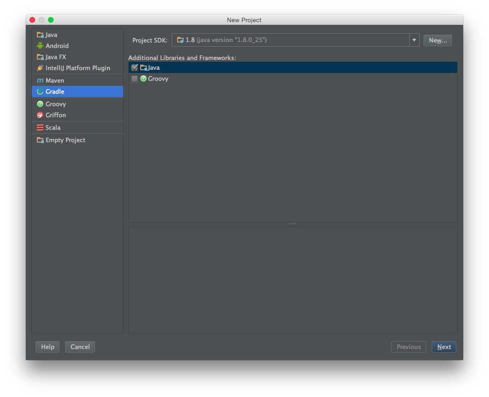
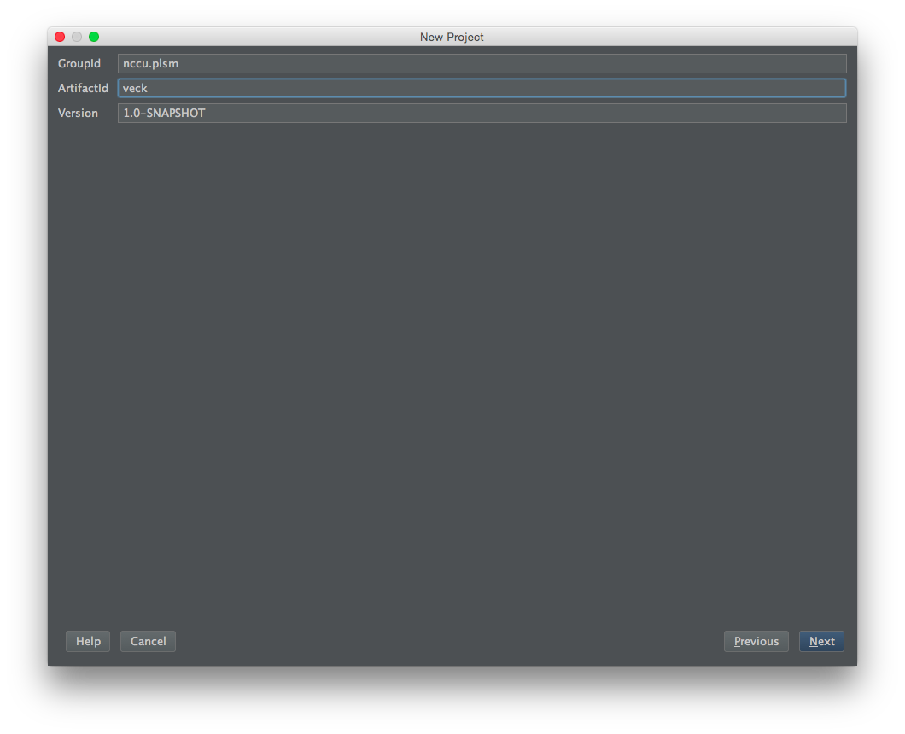
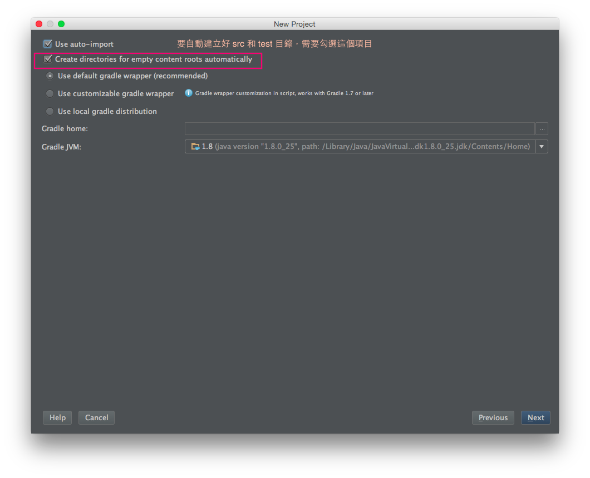
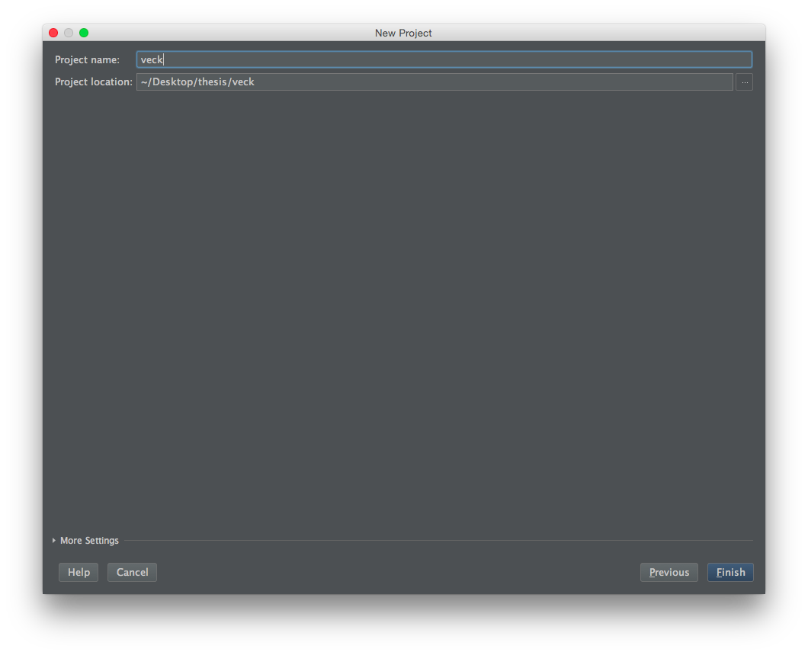
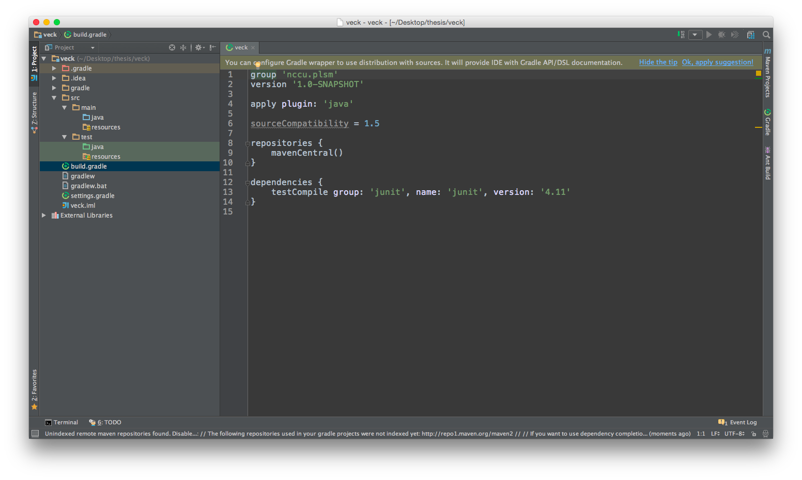
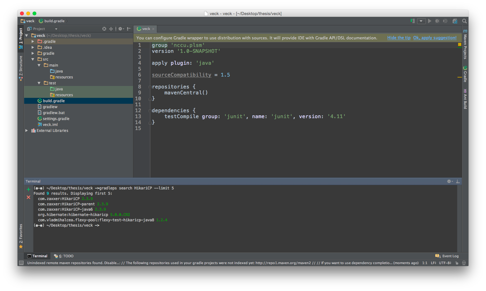
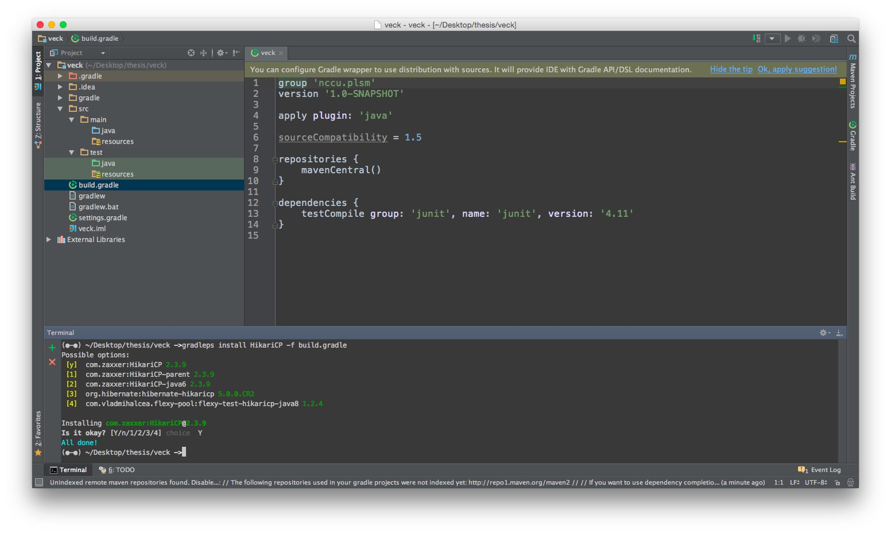
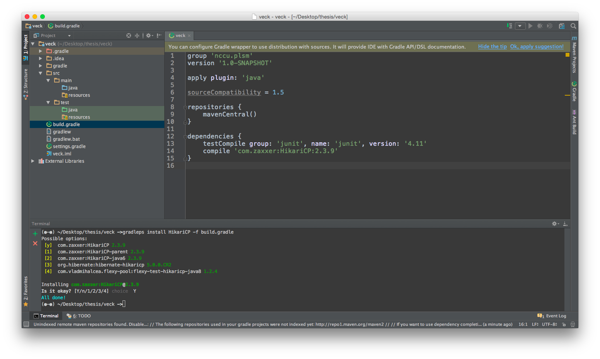

# IntelliJ

## 建立專案
1. 選擇 Gradle

2. 輸入 GroupId 和 ArtifactId

3. 選擇 IntelliJ 建立新專案的項目 (如果沒有勾選 Create directory 那項，就不會自動建立 src 和 test 目錄)

4. 輸入專案名稱

5. 建立好專案了，可以看到 src 和 test 目錄都建好了

## 用 gradleps 來加入要用的套見到 build.gradle
1. 在專案根目錄的 terminal 中輸入 `gradleps search <package-name>` 可以搜尋可用套件

2. 輸入 `gradleps install <package-name> -f build.gradle` 可以加入套件資訊到 build.gradle

3. 加入後點一下 build.gradle 就會出現新加入的項目了

Dependency 中

`compile 'com.zaxxer:HikariCP:2.3.9'` 

的寫法與 

`group: 'com.zaxxer', name: 'HikariCP', version: '2.3.9'` 

相同