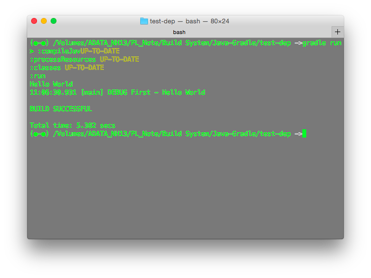

#Introduciton 
Evolution：Ant -> Maven -> Gradle

#Groovy
build.gradle 中用 groovy(DSL) 寫 task 應該是用來擴充 gradle tasks 的 task 項目的

#Create Project
根據[官方文件](http://www.gradle.org/docs/current/userguide/java_plugin.html#N12119)說明，gradle 預設你的 Java 專案結構長這樣:
```
├── build.gradle
└── src
    ├── main
    │   ├── java
    │   └── resources
    ├── sourceSet
    │   ├── java
    │   └── resource
    └── test
        ├── java
        └── resources
```

輸入 `gradle init --type=java`，可建立專案如下：
(支援的 init：'basic', 'groovy-library', 'java-library', 'pom', 'scala-library')

```
.
├── build.gradle
├── gradle
│   └── wrapper
│       ├── gradle-wrapper.jar
│       └── gradle-wrapper.properties
├── gradlew
├── gradlew.bat
├── settings.gradle
└── src
    ├── main
    │   └── java
    │       └── Library.java
    └── test
        └── java
            └── LibraryTest.java

7 directories, 8 files
```

修改 Library.java 的內容與檔名以符合需求

#Build Project
用 `gradle build`:
```
$ gradle build -x test
:compileJava UP-TO-DATE
:processResources UP-TO-DATE
:classes UP-TO-DATE
:jar UP-TO-DATE
:assemble UP-TO-DATE
:check
:build

BUILD SUCCESSFUL

Total time: 4.938 secs
```
(-x, --exclude: exclude tasks)

#Execute Built Project
要直接用 gradle 的 task 執行的話，要在 build.gradle 中加入：
```
task runJar(dependsOn:jar) << {
  javaexec { main="-jar"; args jar.archivePath }
}
``` 
接著就可以輸入 `gradle runjar` 來執行了

或者在 build.gradle 加入 `apply: 'application'` (見 CreateProjectInIntelliJ 的文件)
即可有 `gradle run` 這個 task

#Gradle Dependencies Tool - gradleps
這天正在安裝一個 node 套件，在使用 `npm install --save` 時發現，Maven 或 Gradle 不能像 npm 那樣，建立好 package.json 後只要寫 `{ "dependencies": {} }`，就可以輸入 `npm install --save *` 來安裝並自動加入 package.json 中，如果我要安裝 lucene，不能只要輸入 gradle install lucene；如果我要加入 dependencies，不能只要輸入 `gradle install --save lucene`，你都必須去 Maven Central 查相依套件在 maven 或 gradle 的設定內容後加入 build.gradle，所以我才覺得麻煩，搜尋一下，有人從 npm 過來的也有一樣的懶散習慣，所以就開發一個自動查詢和加入 build.gradle 的工具 gradleps，不過要用 npm install 裝，而且還沒有辦法像 npm install 會自動下載安裝後並加入 build.gradle (也許未來可以幫忙發展)

## Installation & Usage
```bash
$ npm install gradleps -g
```

After installation you can search through Maven Central
```
$ gradleps search guice --limit 5
Found 296 results. Displaying first 5:
  com.google.inject:guice 4.0-beta
  com.jolira:guice 3.0.0
  org.jvnet.hudson:guice 3.0-rc1
  com.mycila.com.google.inject:guice 3.0-20100927
  org.mod4j.com.google.inject:guice 1.0-XTEXT-PATCHED

```

你要建立一個至少包含 dependencies{} 的 build.gradle，接著你就可以自動把套件安裝設定加入 `build.gradle`：
```
$ gradleps install guice -f build.gradle 
Possible options:
 [y]  com.google.inject:guice 4.0-beta
 [1]  com.jolira:guice 3.0.0
 [2]  org.jvnet.hudson:guice 3.0-rc1
 [3]  com.mycila.com.google.inject:guice 3.0-20100927
 [4]  org.mod4j.com.google.inject:guice 1.0-XTEXT-PATCHED
 
Installing com.google.inject:guice@4.0-beta
Is it okay? [Y/n/1/2/3/4] choice  Y
All done!
```

這樣加入以後，在 `gradle build` 或 `gradle run` 就會自動去下載了，但是記得要提供 repository server：
```
repositories {
    mavenCentral()
}
```
(不過在 IntelliJ 中好像要註解起這個 server，好像會找不到)



# Useful Tasks

* `gradle tasks`
	- List the tasks
* `gradle dependencies`
	- Display state of dependencies in each tasks
* `gradle build`
	- Build the project
* `gradle test`
	- Test the project
* `gradle jar`
	- Generate the jar file
* `gradle clean`
	- Clean the project