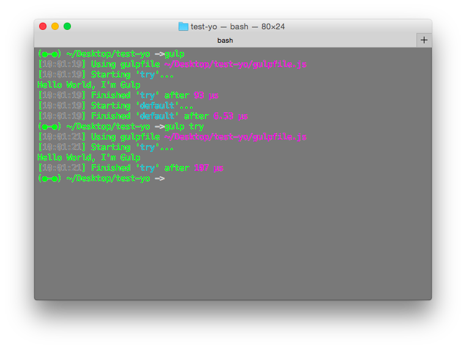

# Gulp vs Grunt

grunt 比較像 maven, gruntfile 比較不好寫：
`gradle: task task-name { /* do your task here*/ }`
	
gulp 比較像是 gradle, gulpfile.js 也是 task based：
`gulp.task('task-name', function(){ /* do your task here */});`

# Usage

1. Install Gulp
除了 `npm install -g gulp`外，還要 `npm install --save-dev gulp`，前者是安裝這個工具到電腦中，後者是在專案中加入這個工具(不然你就算有 gulpfile.js，輸入 gulp server 時會說找不到 local 端的 gulp)

2. Having a gulpfile.js
  * 用 yo 產生專案的話就會一併產生 package.js 和 gulpfile.js (npm init 只會產生 package.js)
  * 不是用 yo 的話，自己用 vim 建立
  
  ```
    var gulp = require('gulp');
    gulp.task('default' funtion(){
      // place code for your default task here
    });
  ```

3. Run
  * `gulp`：run default
  * `gulp <task> <other task>`：run individual tasks



# 工作流程
1. `mkdir project-name`  
2. `cd project-name; yo`
3. `npm install --save-dev gulp`
4. `vim anything` 
5. `gulp <task>`

## Plugins

gulp 有一個很強大的優點是可以透過安裝許多綁定 gulp 的外掛模組來執行這些模組的任務：[http://gulpjs.com/plugins/](http://gulpjs.com/plugins/)
