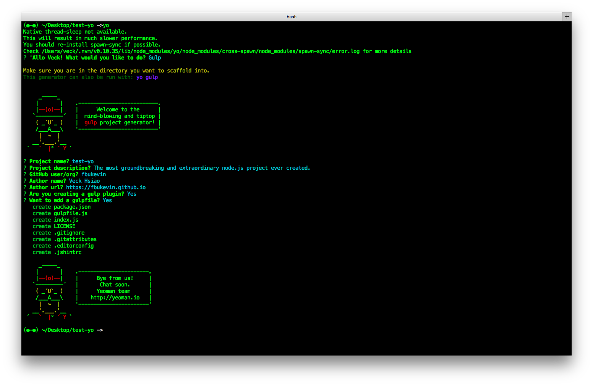
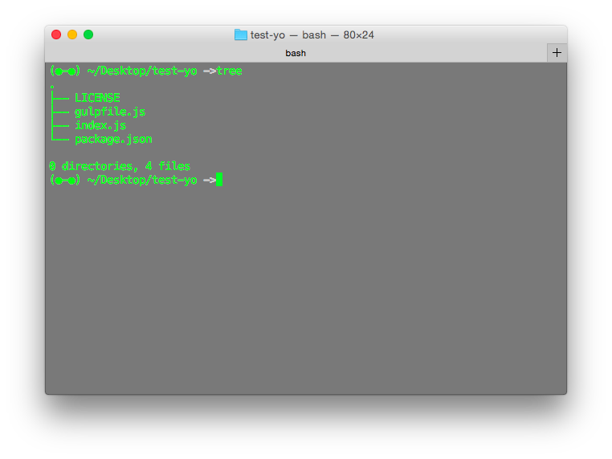
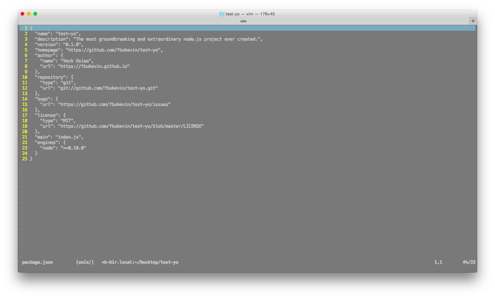
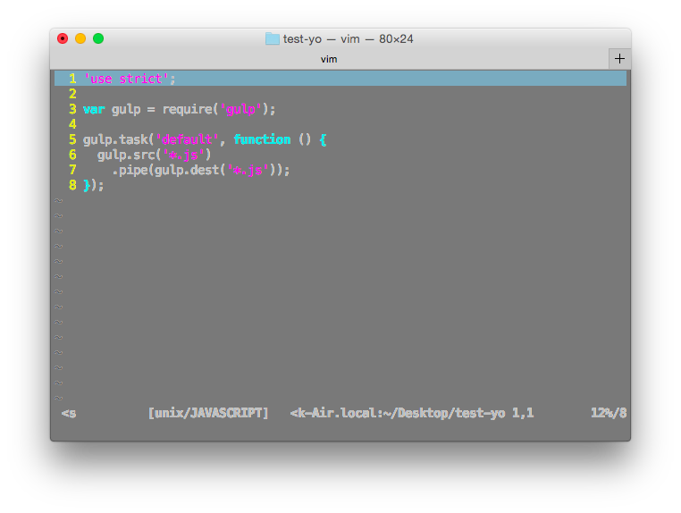
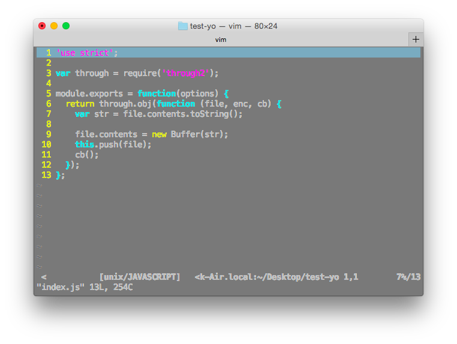

# Yeoman
yeoman 組合: `yo + grunt(->gulp) + bower (-> npm)`

* `yo` seems just a cli tool for generator, it called it does "scaffolding"
* `gulp` is a generator and build system
* `npm` is a package dependency manager

P.S. grunt 是比較舊的 web app 編譯系統，bower 是前端套件(資源)管理系統

使用 yo 前，除了安裝 gulp，還要安裝 generator-gulp，這樣輸入 yo 才不用安裝 generator，不然會一直安裝不了因為沒有辦法輸入 sudo

P.S. Generator 就是像 `npm init`，輸入一到指令後自動化產生檔案結構。

# yo 

1. 使用 yo 來產生專案

2. 產生完檔案以後的檔案結構

3. package.json

4. gulpfile.json

5. index.js

使用了 gulp 當 generator，似乎就不適用 Yeoman 官網的 yeoman-generator 文件了

# generator-gulp-webapp

Yeoman 官方不採用 generator-gulp，而是採用他們自己維護的 generator-gulp-webapp

[https://github.com/yeoman/generator-gulp-webapp](https://github.com/yeoman/generator-gulp-webapp)

這個工具採用的組合是：yo gulp bower

## Getting Started
* Install dependencies: `npm install --global yo gulp bower`
* Install the generator: `npm install --global generator-gulp-webapp`
* Run `yo gulp-webapp` to scaffold your webapp
* Run `gulp serve` to preview and watch for changes
* Run `bower install --save <package>` to install frontend dependencies
* Run `gulp serve:test` to run the tests in the browser
* Run `gulp to build` your webapp for production
* Run `gulp serve:dist` to preview the production build

# Conclude Observation

Yo 好像就只有用來建立專案... 後面都是 gulp 和 npm/bower 的事情了～