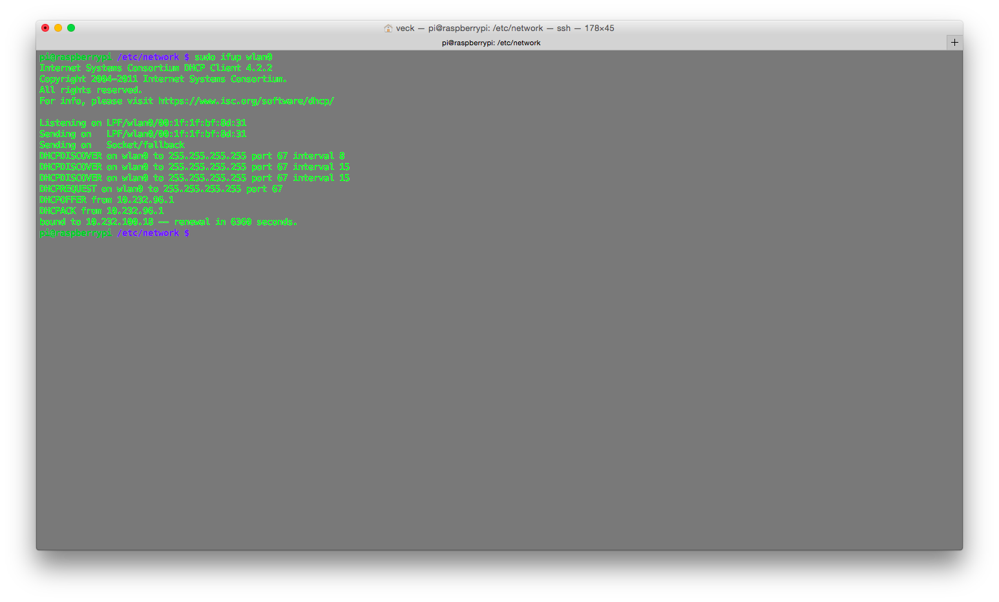

1. 修改 /etc/network/interface:
```
auto wlan0
iface wlan0 inet dhcp
      wireless-essid nccusc	# no quotation
```

2. 重啟
```
sudo ifdown wlan0
sudo ifup wlan0
```


Ping 的到另一台主機了


連線到另一台主機下載檔案


Reference: https://wiki.debian.org/WiFi/HowToUse


`iwlist scan` 可以用來掃描 wifi AP

# Case

連政大校園網路

* 登入：發 POST requst 給驗證 server

用 curl 發 request:
`curl --data "user=102753014&password=rock1612&cmd=authenticate&Login=Log+In" https://securelogin.arubanetworks.com/auth/index.html/u`


```
pi@raspberrypi /etc/network $ ping google.com
PING google.com (163.28.38.15) 56(84) bytes of data.
^C
--- google.com ping statistics ---
4 packets transmitted, 0 received, 100% packet loss, time 2999ms

pi@raspberrypi /etc/network $ curl --data "user=102753014&password=rock1612&cmd=authenticate&Login=Log+In" https://securelogin.arubanetworks.com/auth/index.html/u

<!DOCTYPE html PUBLIC "-//W3C//DTD XHTML 1.0 Transitional//EN" "http://www.w3.org/TR/xhtml1/DTD/xhtml1-transitional.dtd">

<html>
<head>

</head>
<body bgcolor=white text=000000>
<font face="Verdana, Arial, Helvetica, sans-serif" size=+1>
  <b>User Authenticated </b>


<p> Press control-d to bookmark this page.</p>

<script language="JavaScript">
 var url="/cgi-bin/login?cmd=popup";
 var w=210;
 var h=80;
 var x=window.screen.width - w - 20;
 var y=window.screen.height - h - 60;
 window.open(url, 'logout', "toolbar=no,location=no,width="+w+",height="+h+",top="+y+",left="+x+",screenX="+x+",screenY="+y);
</script>

<form action="/cgi-bin/login">
		<input type="submit" name="cmd" value="logout">
</form>
</font>
</body>
</html>

pi@raspberrypi /etc/network $ ping google.com
PING google.com (163.28.38.34) 56(84) bytes of data.
64 bytes from 163.28.38.34: icmp_req=1 ttl=60 time=2.19 ms
64 bytes from 163.28.38.34: icmp_req=3 ttl=60 time=209 ms
64 bytes from 163.28.38.34: icmp_req=4 ttl=60 time=7.34 ms
64 bytes from 163.28.38.34: icmp_req=5 ttl=60 time=9.44 ms
^C
--- google.com ping statistics ---
5 packets transmitted, 4 received, 20% packet loss, time 4013ms
rtt min/avg/max/mdev = 2.199/57.179/209.726/88.112 ms
```

* 登出：發 GET request 給驗證 server

用 curl 發 requst：
`curl https://securelogin.arubanetworks.com/cgi-bin/login?cmd=logout`

```
pi@raspberrypi /etc/network $ curl https://securelogin.arubanetworks.com/cgi-bin/login?cmd=logout
<!DOCTYPE html PUBLIC "-//W3C//DTD XHTML 1.0 Transitional//EN" "http://www.w3.org/TR/xhtml1/DTD/xhtml1-transitional.dtd">

<html>
<body bgcolor=white text=000000>
<b>Logout Successful</b>
<form>
 <input type="button" onclick="window.close()" name="close" value="Close Window">
</form>
</body>
</html>
```