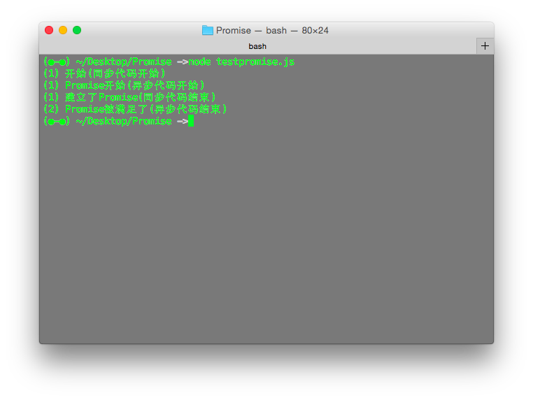
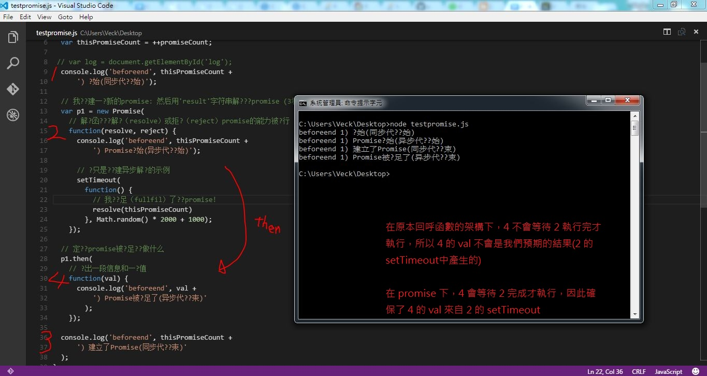

promise 的執行會是同步的嗎?

註冊 callback 的物件在註冊完以後並不會 block 住等待 callback 完成<br>
會繼續執行下一行指令

那 promise 的 callback chain 是否是同步的呢?<br>
好像不是喔~~~~

promise 解決的問題好像是對於 callback 之間資料無法傳遞的問題???<br>
callback A 中若有 callback B，且 B 後面有需要用到 B 結果的 A 物件，callback hell 會使得該 A 物件無法使用到 B 的結果(因為註冊完 B 就往下繼續執行完 A 了)<br>
promise 好像是讓 callbackA, callback B 分開，變成 then(B).then(A)<br>
這樣就可以確保執行完 B 以後可以將結果給 A 內的物件用 (原本 A 中在 B 之前的敘述需要改寫)<br>
但這樣並不是同步，因為 註冊完 then(B).then(A) 以後，程式還是會往下繼續<br>


MDN 的範例：
```
'use strict'

var Promise = require('promise');

var promiseCount = 0;
function testPromise() {
  var thisPromiseCount = ++promiseCount;

  console.log( '(' + thisPromiseCount +') 开始(同步代码开始)');

  // 我们创建一个新的promise: 然后用'result'字符串解决这个promise (3秒后)
  var p1 = new Promise(
    // 解决函数带着解决（resolve）或拒绝（reject）promise的能力被执行
    function(resolve, reject) {
      console.log('(' + thisPromiseCount + ') Promise开始(异步代码开始)');

      // 这只是个创建异步解决的示例
      setTimeout(
        function() {
          // 我们满足（fullfil）了这个promise!
          resolve(2);          
        }, Math.random() * 2000 + 1000);
    });

  // 定义当promise被满足时应做什么
  p1.then(
    // 输出一段信息和一个值
    function(val) {
      console.log('(' + val + ') Promise被满足了(异步代码结束)' );
    });

  console.log('(' + thisPromiseCount + ') 建立了Promise(同步代码结束)');
}

testPromise();
```



執行流程的分析



# .pipe() vs .then()

這邊提的是 JavaScript 的方法，而非 jQuery 的

* `.pipe()` is method of Stream，類似 Unix 的 pipe (|)：
	
	```	
	var r = fs.createReadStream('file.txt');
	var z = zlib.createGzip();
	var w = fs.createWriteStream('file.txt.gz');
	r.pipe(z).pipe(w);	// 表示對 r 先做 z，在把 z 的結果給 w 用
	```
	
* `.then()` is method of Promise

不過他們都有一個『傳遞給下一個方法』的概念