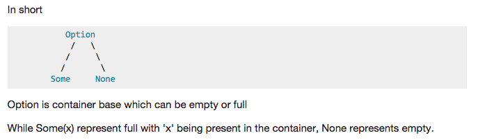

# 解決的問題
Option[T] 到底想要解決什麼樣的問題呢？其實答案很簡單－－讓我們可以知道某個可能沒有值的東西到底有沒有值。

其實問題在於我們以前在 Java 程式中用 null 來代表沒有返回值的情況，很容易造成語意的不清，而沒辦法準確標示出某個東西是否是「可能有、有可能沒有」的。

val a: Option[String] = Some(aStr) 如果有東西 aStr 有東西
就可以用 a.get 取得 aStr 這個字串的內容，否則會有 NoSuchElementException
看到 a 的形態是 Option[String]，我們可以很清楚的知道這個物件(用 def 宣告就是函式)的返回值很有可能是空的

由於 Scala 為了與 Java 維持一定的交互操作性，所以 Scala 當中還是有 null 的存在，寫程式的時候，我們還是可以讓一個標註返回型別是 String 函式還是可以回傳 null 給呼叫者，不過在 Scala 的慣例裡並不會這麼做，習慣上寫 Scala 程式碼的時候不應該出現 null，函式也永遠不應該返回 null，任何原本我們習慣用 null 代表的地方都應該改用 Option[T] 來表示

# Option[T]?
Option[T] 是一個盒子，這個盒子可能會有兩種狀況－－裡面裝了一個 T 型別的東西，也有可能這個盒子是空的，裡面什麼也沒有。

當我們拿到一個 Option[Int] 的時候，我們知道他是一個可以裝 Int 的盒子，但因為他還沒有打開，所以我們不曉得裡面到底有沒有東西，但我們知道他只會有兩種狀況－－裡面有裝了一個 Int，又或者裡面什麼都沒有。
當我們要表示裡面裝了一個 Int 的時候，可以用 Some[Int] 來表示，而當裡面什麼都沒有的時候，我們可以用 None 這個 Singleton 物件來表示

參考：http://www.codedata.com.tw/java/scala-tutorial-9-option